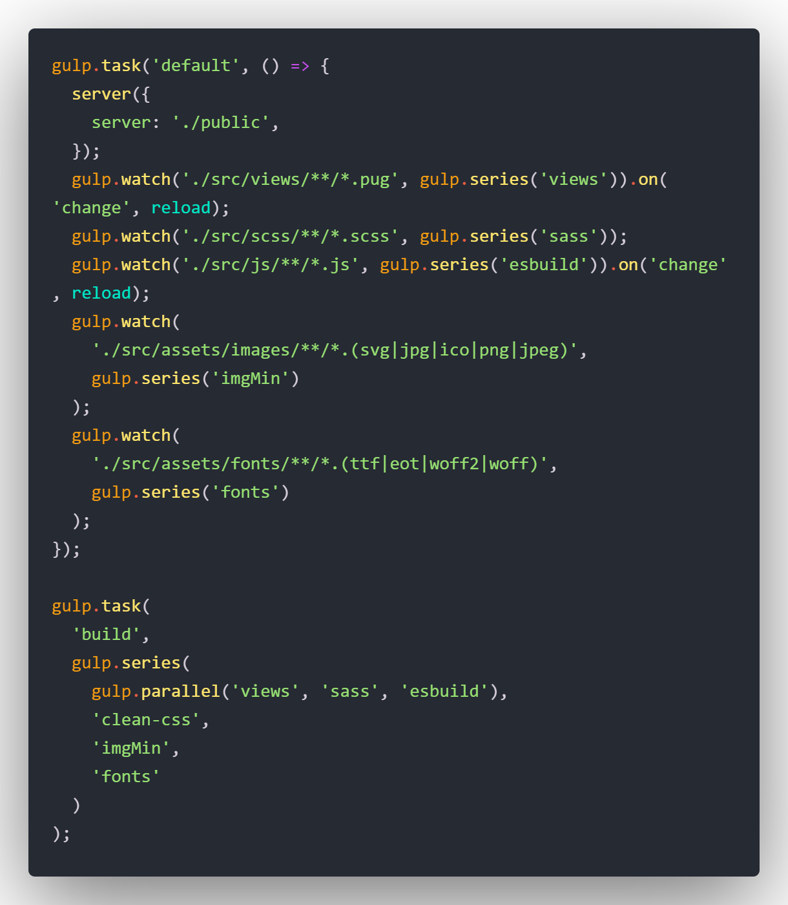

<h1 align="center">Gulp Workflow </h1>

# Gulp Workflow to compile javascript, css, html and images

Workflow of pug, sass and esBuild for static page projects.

Use Gulp version 4 to execute the tasks.

Transpile the HTML, CSS and JavaScript so that it is possible to work in a development folder and another folder with all the minified and built files for uploading to the server

Optimizes JPG, JPEG, GIF, PNG and SVG images

Use Browser Sync to mode development.

***

<p align="center">
  
</p>

## How To Use

To clone and run this application, you'll need [Git](https://git-scm.com) and [Node.js](https://nodejs.org/en/download/) (which comes with [npm](http://npmjs.com)) or [yarnjs](https://yarnpkg.com/) installed on your computer. From your command line:

```bash
# Clone this repository
$ git clone https://github.com/cqrlosArch/workflow-gulp

# Install dependencies
$ 'yarn install' or 'npm install'

# Run script mode development
$ 'yarn start' or 'npm start'

# Run script mode production
$ 'yarn build' or 'npm run build'
```

## Details

### Built With

- [Gulp](https://gulpjs.com/)
- [esBuild](https://esbuild.github.io/)
- [Sass](https://sass-lang.com/)
- [Pug](https://pugjs.org/api/getting-started.html)
- [Browser-Sync](https://browsersync.io/)
- [Imagemin](https://github.com/imagemin/imagemin)

## License

[MIT License](./LICENSE)

## Contact

- Discord [CqrlosArch#0296](https://discord.com/)
- Twitch [@cqrlosarch](https://www.twitch.tv/cqrlosarch/about)
- GitHub [@cqrlosArch](https://github.com/cqrlosArch)
- Twitter [@cqrlosArch](https://twitter.com/cqrlosArch)
- Youtube [Cqrlos Arch](https://www.youtube.com/channel/UCV8eaXiCFXUN5Rkpc42G3ZQ)